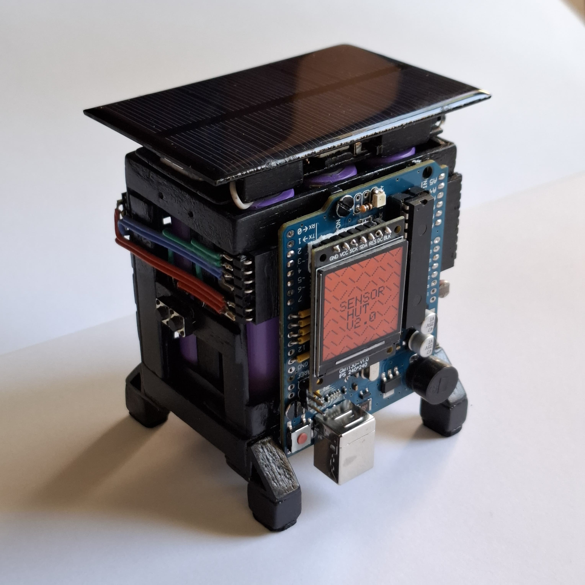
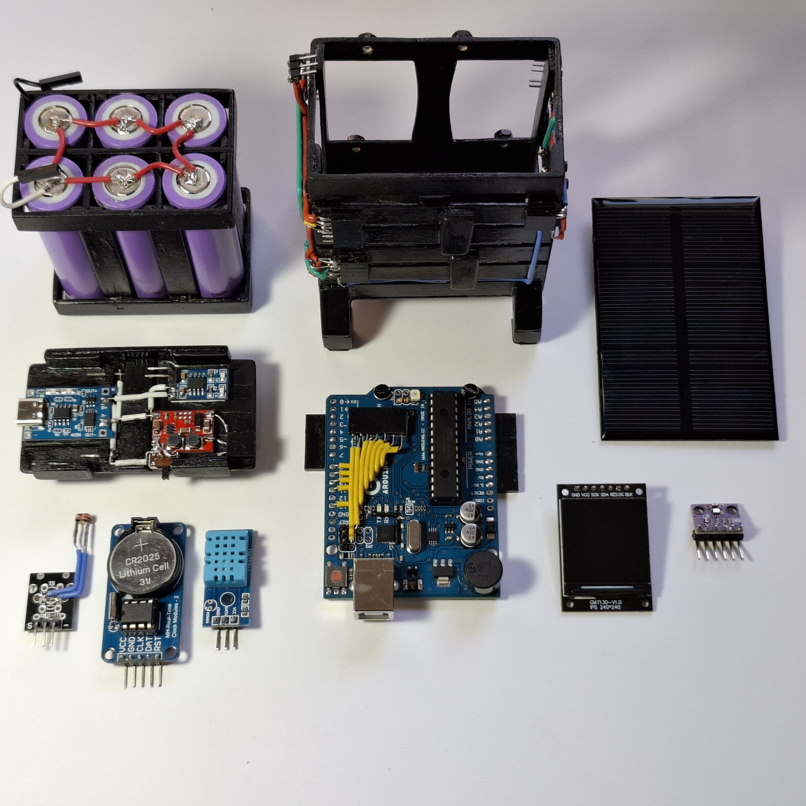

# SensorHut V2

 
  
  

## Description
- The SensorHut is an Arduino-powered sensor array that can measure temperature, humidity, barometric pressure, light level, along with time-keeping and battery voltage measurement. It has a 2.4" LCD display that shows all this data, two push buttons, and a 6-cell rechargeable battery pack that can keep it powered for up to 2 weeks.

### Features
- **All the sensors are removable**, along with the battery pack, Arduino, and power circuit, allowing for easy maintenance, replacement, or reuse of components.
- It is powered by six 2200mAh LiPo batteries that can be recharged through USB-C or an attachable solar panel.
- The power consumption is 145mW while in sleep mode and 925mW while the screen is lit. Given the battery capacity and assuming no solar charging, the device should last about 15 days.
- It features two push buttons:
  - The first button refreshes sensor data and turns on the display for the programmed 16 seconds.
  - The second button toggles **power-saving mode**, which disables the LED, buzzer, and display backlight for a longer duration (10 minutes for power-saving mode, 1 minute for standard mode).
- The main Arduino board has been heavily modified to decrease power consumption and ease assembly:
  - All female pin sockets were removed and reattached on the underside of the board.
  - Since the required 5V is generated with an external step-up converter, the 12V power connector was replaced with a buzzer.
  - An LED and the 1.3" LCD display were wired and attached directly to the Arduino board, reducing the number of placed components and making them visible.
  - Always-on and auxiliary LEDs were removed.
  - The power pins on the ATMEGA16U2 auxiliary IC, along with the RX and TX LEDs, were rewired to be active only when the board is connected via the USB-B port ([tutorial](https://www.defproc.co.uk/tutorial/how-to-reduce-arduino-uno-power-usage-by-95/)).

 
  
  
   
  

## Improvements Added in Version 2
- Version 2's frame was built from popsicle sticks attached with Loctite superglue, offering a much stronger structure compared to Version 1's 1mm steel wireframe.
- Five more batteries were added to greatly increase battery capacity.
- Greater attention was given to frame design. The whole SensorHut was designed in tandem in Fusion 360 to ensure proper sizing and simplify assembly.
- The Arduino board is now much more visible and plays a bigger role in the overall aesthetics of the SensorHut.
- The power delivery circuits were removed from the solar panel and placed on a dedicated frame on top of the hut.
- The SensorHut can now function entirely without the solar panel (in Version 1, the solar charging was very weak).
- The wire harness was greatly simplified from the previous "spiderweb" mess. Wires are now routed neatly along the left and right sides of the hut and can easily be removed by detaching the right-angle pin headers from the Arduino sockets.

## Bill of Materials
- Arduino Uno Rev3 - [www.arduino.cc](https://store.arduino.cc/en-ro/products/arduino-uno-rev3?srsltid=AfmBOoqwYtjsYzje5ZUn_HA9sHTWeZQG49rOnZmOxhYvX3LoTWP9tqha)
- DHT11 module - [www.optimusdigital.ro](https://www.optimusdigital.ro/en/temperature-sensors/4762-modul-senzor-de-temperatura-dht11-cu-led.html?search_query=dht+11&results=25)
- BMP280 module - [www.optimusdigital.ro](https://www.optimusdigital.ro/en/pressure-sensors/12417-modul-senzor-de-presiune-barometric-bmp280.html?search_query=bmp280&results=17)
- KY-018 module - [www.optimusdigital.ro](https://www.optimusdigital.ro/en/optical-sensors/13060-photosensitive-resistor-sensor-module-for-arduino.html?search_query=photoresistor&results=19)
- DS1302 module - [www.optimusdigital.ro](https://www.optimusdigital.ro/en/all-products/12988-ds1302-real-time-clock-module-no-battery.html)
- ST7789 TFT LCD - [www.aliexpress.com](https://www.aliexpress.com/item/1005008175467166.html)
- 2x push buttons - [www.optimusdigital.ro](https://www.optimusdigital.ro/en/buttons-and-switches/1119-6x6x6-push-button.html?search_query=tactile+switch&results=25)
- Passive buzzer - [www.optimusdigital.ro](https://www.optimusdigital.ro/en/buzzers/634-5v-passive-buzzer.html?search_query=buzzer&results=87)
- Single-strand wires - [www.optimusdigital.ro](https://www.optimusdigital.ro/en/kits/11951-plusivo-pvc-insulated-wire-kit-20awg-6-colors-7m-each.html)
- 5.5V 120mA polycrystalline solar cell - [www.aliexpress.com](https://www.aliexpress.com/item/1005007402518746.html)
- 1A 5V for 3.7V solar controller - [www.aliexpress.com](https://www.aliexpress.com/item/1005003063466363.html)
- 2.5–15V to 5V step-up voltage regulator - [www.aliexpress.com](https://www.aliexpress.com/item/1005005911490910.html)
- 5V 1A USB-C lithium battery charger - [www.aliexpress.com](https://www.aliexpress.com/item/1005003598600322.html)
- 6x 3.7V 2200mAh rechargeable batteries - [www.aliexpress.com](https://www.aliexpress.com/item/1005001265547747.html)
- 2.54mm pitch pin headers and sockets of various lengths - [www.optimusdigital.ro](https://www.optimusdigital.ro/en/kits/4737-connector-assortment-kit-1004-pcs.html?search_query=pin+header+kit&results=105)
- 1MΩ resistor
- 330Ω resistor
- Green SMD LED
- SPDT switch
- 30x1mm steel wires (for 2x clamps)
- Popsicle sticks (for the frame)

## Version 1 Schematic
(Note: Version 2 has a different pinout.)

## Version 1 Images
Bare frame with all detachable components removed

  
  

Components

  
  

